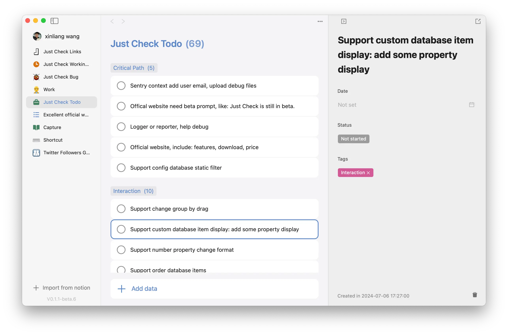

  

	
  
    

<H2 align="center">Just Check</H2>

Seamlessly Integrating with Notion to Connect Your Databases into Actionable To-Do Lists, Memos, and More!

## Feedback and Sugestions

You can give us feedback or suggestions by adding an issue [here](https://github.com/wxllive/just-check/issues).
